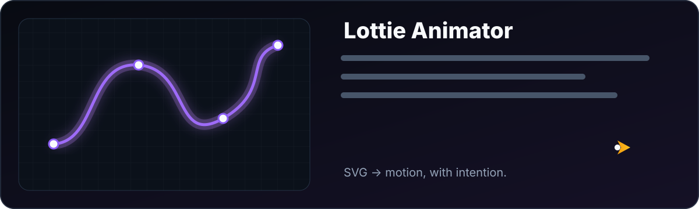

# Lottie Animator Skill

<div align="center">

<!-- Animated Banner -->
<picture>
  <source media="(prefers-color-scheme: dark)" srcset="assets/banner.svg">
  <source media="(prefers-color-scheme: light)" srcset="assets/banner.svg">
  
</picture>

<br><br>


<!-- Dynamic Badges -->
[](https://github.com/obeskay/lottie-animator-skill/stargazers)
[](https://github.com/obeskay/lottie-animator-skill/network/members)
[](https://github.com/obeskay/lottie-animator-skill/watchers)

[](https://github.com/obeskay/lottie-animator-skill/commits)
[](https://github.com/obeskay/lottie-animator-skill/issues)
[](https://github.com/obeskay/lottie-animator-skill/pulls)

**Generate professional Lottie animations from SVGs using AI**

*Replace After Effects with intelligent motion design*

[Quick Start](#-quick-start-svg-to-lottie-in-60-seconds) • [Installation](#installation) • [Features](#features) • [Examples](#-live-examples)

</div>

---

## 🎬 See It In Action

<div align="center">

### From Static SVG → Animated Lottie

```
┌──────────────────┐          ┌──────────────────┐          ┌──────────────────┐
│                  │          │                  │          │    ✨    ✨      │
│    📄 SVG        │    →     │   🤖 Claude +    │    →     │   🚀             │
│    (static)      │          │   Lottie Skill   │          │  🔥 (animated!)  │
│                  │          │                  │          │  💨              │
└──────────────────┘          └──────────────────┘          └──────────────────┘
     rocket.svg                  "Animate this!"              rocket-animated.json
```

### Example Animations

| Rocket Launch | Chimp Walk Pro | Running Cat |
|:-------------:|:--------------:|:-----------:|
| Bounce → Flames → Stars | Frame-by-frame walk cycle | Professional 82-layer animation |
| [`rocket-animated.json`](examples/rocket-animated.json) | [`chimp-walk-pro.json`](examples/chimp-walk-pro.json) | Reverse-engineered for learning |

**👆 Preview:** Drag any `.json` file to [LottieFiles Preview](https://lottiefiles.com/preview)

</div>

---

## Live Demo

<div align="center">

|  |  |  |
|:---:|:---:|:---:|
| Bounce + Scale + Particles | Frame-by-Frame Animation | Trim Path + Draw On |
| [Preview →](https://lottiefiles.com/preview) | [Preview →](https://lottiefiles.com/preview) | [Preview →](https://lottiefiles.com/preview) |

**Try the animations yourself:**

1. Download any `.json` from [`examples/`](examples/)
2. Drag to [LottieFiles Preview](https://lottiefiles.com/preview)
3. Watch the magic!

**Or run locally:**
```bash
# Open the live preview page
open assets/preview-embedded.html
```

</div>

---

## Why Lottie Animator?

<table>
<tr>
<td width="50%">

### ❌ Traditional Workflow
- **After Effects** ($22.99/mo)
- **Bodymovin plugin** setup
- **Hours** of manual keyframing
- Motion design expertise required

</td>
<td width="50%">

### ✅ With Lottie Animator
- **Zero cost** - Open source
- **Seconds** not hours
- Natural language instructions
- No expertise needed

</td>
</tr>
</table>

---

## 🚀 Quick Start: SVG to Lottie in 60 Seconds

### Step 1: Grab any SVG icon

From [Lucide](https://lucide.dev), [Phosphor](https://phosphoricons.com), or your own design:

<details>
<summary><b>📄 rocket.svg</b> (click to expand)</summary>

```xml
<svg xmlns="http://www.w3.org/2000/svg" width="24" height="24" viewBox="0 0 24 24"
     fill="none" stroke="currentColor" stroke-width="2">
  <path d="M4.5 16.5c-1.5 1.26-2 5-2 5s3.74-.5 5-2c.71-.84.7-2.13-.09-2.91a2.18 2.18 0 0 0-2.91-.09z"/>
  <path d="m12 15-3-3a22 22 0 0 1 2-3.95A12.88 12.88 0 0 1 22 2c0 2.72-.78 7.5-6 11a22.35 22.35 0 0 1-4 2z"/>
  <path d="M9 12H4s.55-3.03 2-4c1.62-1.08 5 0 5 0"/>
  <path d="M12 15v5s3.03-.55 4-2c1.08-1.62 0-5 0-5"/>
</svg>
```
</details>

### Step 2: Tell Claude what animation you want

```
You: Create a fun rocket launch animation - bounce before launch,
     add flames, smoke particles, and twinkling stars!
```

### Step 3: Get professional Lottie JSON

```
┌────────────────────────────────────────────────────────────────┐
│  ✅ Motion Philosophy: Playful + Energetic                     │
│  ✅ Animation: 60fps, 90 frames (1.5s loop)                    │
│  ✅ Layers generated:                                          │
│     • Rocket body with bounce entrance (bezier overshoot)      │
│     • Gradient flame with scale flicker                        │
│     • 2x smoke particles (fade + expand + drift)               │
│     • 3x stars (pop-in + rotate + twinkle)                     │
│  ✅ Output: rocket-animated.json (4.2KB)                       │
└────────────────────────────────────────────────────────────────┘
```

### Animation Timeline

```
Frame 0-15:   🚀 Rocket bounces in (scale 0→115→100 with overshoot)
Frame 15-25:  🔥 Flames ignite, anticipation wobble
Frame 25-90:  ⬆️  LAUNCH! Rocket flies up with easing
Frame 25-75:  💨 Smoke particles expand and fade
Frame 50-90:  ✨ Stars pop in, rotate, and twinkle
```

**Try it yourself:** [`examples/rocket-animated.json`](examples/rocket-animated.json) → Drag to [LottieFiles Preview](https://lottiefiles.com/preview)

---

## Installation

### From Marketplace (Recommended)

```bash
# Add the marketplace
/plugin marketplace add obeskay/lottie-animator-skill

# Install the plugin
/plugin install lottie-animator
```

### Local Installation

```bash
# Clone the repository
git clone https://github.com/obeskay/lottie-animator-skill.git

# Use with Claude Code
claude --plugin-dir ./lottie-animator-skill
```

## Usage

The skill activates automatically when you request:

```
"Animate this SVG logo"
"Create a Lottie animation"
"Generate motion graphics for my icon"
"Make a bounce/wiggle/pulse effect"
"Create an entrance/loading/loop animation"
```

---

## Features

### 🎨 Professional Bezier Curves

| Preset | Curve | Use Case |
|--------|-------|----------|
| `ease-out-cubic` | `(0.33, 0, 0.67, 1)` | Smooth entrances |
| `ease-in-out-quart` | `(0.76, 0, 0.24, 1)` | Professional transitions |
| `bounce` | `(0.34, 1.56, 0.64, 1)` | Playful interactions |
| `elastic` | `(0.68, -0.6, 0.32, 1.6)` | Dynamic feedback |
| `spring` | `(0.5, 1.5, 0.5, 1)` | Natural motion |

### 🎬 Animation Types

| Type | FPS | Duration | Best For |
|------|:---:|:--------:|----------|
| Corporate | 30 | 1.5-2s | B2B, Finance |
| Organic | 60 | 2-3s | Audio, Creative |
| Bold | 60 | 0.8-1.5s | Startups, Marketing |
| Cinematic | 60 | 3-5s | Luxury, Entertainment |

### ✨ Supported Effects

| Category | Effects |
|----------|---------|
| **Entrance** | Fade, Scale, Slide, Reveal, Bounce |
| **Loop** | Pulse, Wiggle, Float, Rotate, Breathe |
| **Attention** | Bounce, Shake, Flash, Jiggle |
| **Advanced** | Morph, Stagger, Draw-on, Path follow |
| **Pro** | Parenting, Track Mattes, Masks, **Frame-by-Frame** |

### 🎯 Professional Techniques (Reverse-Engineered)

Learned from analyzing professional animations like [Running Cat](https://lottiefiles.com):

| Technique | Use Case | Example |
|-----------|----------|---------|
| **Frame-by-Frame** | Walk/run cycles | 6 poses × 6 frames = 36 frame loop |
| **Layer Parenting** | Character rigs | Shadow controls 13+ body parts |
| **Stroke + Fill** | Outline style | Dark stroke + colored fill |
| **ip/op Switching** | Pose animation | Layers appear/disappear per pose |

```
Frame-by-Frame Walk Cycle:
┌─────┬─────┬─────┬─────┬─────┬─────┐
│Pose1│Pose2│Pose3│Pose4│Pose5│Pose6│ ← Each pose is a separate layer
├─────┼─────┼─────┼─────┼─────┼─────┤
│ 0-6 │6-12 │12-18│18-24│24-30│30-36│ ← ip/op frame ranges
└─────┴─────┴─────┴─────┴─────┴─────┘
```

---

## 📦 Example Animations

### 1. Rocket Animated
**File:** [`examples/rocket-animated.json`](examples/rocket-animated.json) | **Source:** [Lucide rocket.svg](examples/rocket-icon.svg)

```
Layers (7):
├── Stars ×3 (pop-in + rotate + twinkle)
├── Smoke ×2 (fade + expand + drift)
├── Flame (gradient + scale flicker)
└── Rocket Body (bounce entrance → launch)

Techniques:
• Scale overshoot (bezier 0.34, 1.56) for bounce
• Staggered star timing (frame 50, 55, 60)
• Gradient fill for realistic flame
• Ease-out curve for launch deceleration
```

### 2. Chimp Walk Pro
**File:** [`examples/chimp-walk-pro.json`](examples/chimp-walk-pro.json) | **Technique:** Frame-by-Frame

```
Layers (5):
├── Shadow (parent for all poses, scale pulse)
├── Pose 1 - Contact Left  (ip: 0,  op: 9)
├── Pose 2 - Passing Left  (ip: 9,  op: 18)
├── Pose 3 - Contact Right (ip: 18, op: 27)
└── Pose 4 - Passing Right (ip: 27, op: 36)

Techniques:
• Frame-by-frame (4 poses × 9 frames = 36 total)
• Shadow as parent layer (moves all children)
• Stroke + fill for outline style
• 60fps, 0.6s seamless loop
```

### 3. Bounce Entrance Template

```json
{
  "s": {
    "a": 1,
    "k": [
      {"t": 0, "s": [0, 0], "o": {"x": [0.34], "y": [1.56]}, "i": {"x": [0.64], "y": [1]}},
      {"t": 20, "s": [110, 110]},
      {"t": 35, "s": [100, 100]}
    ]
  }
}
```
*Copy this keyframe structure for any bounce-in effect!*

---

## 🔧 Use in Your App

<details>
<summary><b>React / Next.js</b></summary>

```bash
npm install lottie-react
```

```jsx
import Lottie from 'lottie-react';
import rocketAnimation from './rocket-launch.json';

export default function LaunchButton() {
  return (
    <Lottie
      animationData={rocketAnimation}
      loop={false}
      style={{ width: 200, height: 200 }}
    />
  );
}
```
</details>

<details>
<summary><b>Vue 3</b></summary>

```bash
npm install vue3-lottie
```

```vue
<template>
  <Vue3Lottie :animationData="rocket" :loop="true" />
</template>

<script setup>
import { Vue3Lottie } from 'vue3-lottie'
import rocket from './rocket-launch.json'
</script>
```
</details>

<details>
<summary><b>Vanilla JS / HTML</b></summary>

```html
<script src="https://unpkg.com/@lottiefiles/lottie-player@latest"></script>

<lottie-player
  src="rocket-launch.json"
  background="transparent"
  speed="1"
  loop
  autoplay>
</lottie-player>
```
</details>

<details>
<summary><b>React Native</b></summary>

```bash
npm install lottie-react-native
```

```jsx
import LottieView from 'lottie-react-native';

export default function Animation() {
  return (
    <LottieView
      source={require('./rocket-launch.json')}
      autoPlay
      loop
      style={{ width: 200, height: 200 }}
    />
  );
}
```
</details>

---

## 📚 Documentation

| Reference | Description |
|-----------|-------------|
| [Bezier Easing](skills/lottie-animator/references/bezier-easing.md) | 20+ professional easing presets |
| [Lottie Structure](skills/lottie-animator/references/lottie-structure.md) | Complete JSON specification |
| [Examples](skills/lottie-animator/references/examples.md) | 8 ready-to-use animations |
| [SVG to Lottie](skills/lottie-animator/references/svg-to-lottie.md) | Conversion guide |

## 🔗 Resources

- [Lottie Documentation](https://lottiefiles.github.io/lottie-docs/) - Official spec
- [LottieFiles Preview](https://lottiefiles.com/preview) - Test your animations
- [Cubic Bezier Editor](https://cubic-bezier.com/) - Design custom easing
- [Easings.net](https://easings.net/) - Easing function reference
- [Lucide Icons](https://lucide.dev/) - Beautiful SVG icons
- [Phosphor Icons](https://phosphoricons.com/) - Flexible icon family

---

## 🤝 Contributing

Contributions welcome! Please feel free to submit a Pull Request.

```bash
# Fork and clone
git clone https://github.com/YOUR_USERNAME/lottie-animator-skill.git

# Create feature branch
git checkout -b feature/amazing-feature

# Commit and push
git commit -m 'Add amazing feature'
git push origin feature/amazing-feature

# Open PR
```

## 📄 License

MIT License - see [LICENSE](LICENSE) for details.

## 👤 Author

**Obed Vargas**

[](https://obeskay.com)
[](mailto:hola@obeskay.com)
[](https://github.com/obeskay)

---

<div align="center">

### ⭐ Star this repo if you find it useful!

**Made with AI for designers and developers**

*No After Effects required*

<br>

🚀 **Try it now:**

```
"Animate my logo with a playful bounce"
```

<br>

[](https://star-history.com/#obeskay/lottie-animator-skill&Date)

</div>
