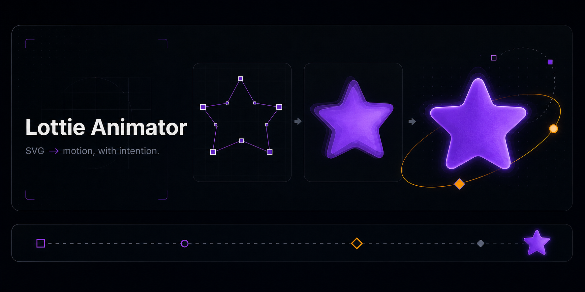

# Lottie Animator

<div align="center">



**SVG → motion, with intention.**

An AI skill for creating polished Lottie animations from SVGs — with clear motion direction, native JSON, and a fast validation loop.

[Quick start](#quick-start) · [Examples](#examples) · [Install](#install) · [Docs](#how-it-works)


</div>

## Quick start

Install the skill, then ask Claude Code for motion in plain language:

```bash
/plugin marketplace add obeskay/lottie-animator-skill
/plugin install lottie-animator
```

```text
Animate this SVG with a premium entrance and a seamless loop.
Keep the path clean, use violet and amber accents, and export Lottie JSON.
```

Preview everything locally:

```bash
open assets/preview-embedded.html
```

## The workflow

<div align="center">

| 01 · Read | 02 · Direct | 03 · Build | 04 · Check |
|:---:|:---:|:---:|:---:|
| SVG structure | Motion personality | Keyframes | Preview + revise |

</div>

The skill keeps the process focused: understand the vector, choose one motion idea, stage the hero, then inspect the loop before shipping it.

## Examples

| Demo | What it shows |
|---|---|
| [`rocket-animated.json`](examples/rocket-animated.json) | Bounce, scale, particles |
| [`chimp-walk-pro.json`](examples/chimp-walk-pro.json) | Frame-by-frame character motion |
| [`panda-loader.json`](examples/panda-loader.json) | A friendly loading loop |
| [`morphing-star.json`](examples/morphing-star.json) | Scale, rotation, orbit, easing |

Validate every example with the included smoke test:

```bash
python3 scripts/validate_lottie.py
```

The check covers JSON structure, timing, canvas dimensions, and layer ranges. Then open the result and inspect the first, middle, and final loop states.

## Install

### Claude Code plugin

```bash
git clone https://github.com/obeskay/lottie-animator-skill.git
claude --plugin-dir ./lottie-animator-skill
```

### Use the skill directly

Copy `skills/lottie-animator/` into your skills directory. The detailed references live beside the skill:

- [Lottie structure](skills/lottie-animator/references/lottie-structure.md)
- [SVG → Lottie](skills/lottie-animator/references/svg-to-lottie.md)
- [Motion personality](skills/lottie-animator/references/motion-personality.md)
- [Professional techniques](skills/lottie-animator/references/professional-techniques.md)

## How it works

The skill uses a compact motion brief before touching keyframes:

```text
Emotion      → what should this feel like?
Personality  → playful, premium, corporate, or energetic
Hero         → position, scale, rotation, or opacity
Timing       → entrance, settle, loop
Details      → secondary accents that support the hero
```

It supports draw-on paths, morphing, trim paths, loaders, staggered entrances, character rigs, frame-by-frame cycles, and GSAP/Lottie integration.

## Design language

The project uses a focused visual system:

| Obsidian | Electric violet | Amber |
|:---:|:---:|:---:|
| `#090D16` | `#A855F7` | `#F59E0B` |

Dark surfaces keep the work legible. Violet carries the hero motion. Amber marks transitions, timing, and energy.

## Contributing

Keep examples small, readable, and previewable. Run the validator before opening a pull request.

See [CONTRIBUTING.md](CONTRIBUTING.md).

## License

MIT — see [LICENSE](LICENSE).

<div align="center">

Made for designers and developers who want motion to feel deliberate.

[GitHub](https://github.com/obeskay/lottie-animator-skill) · [Obeskay](https://obeskay.com)

</div>
