<div align="center">

# Lottie Animator

**Motion that is looked at before it ships.**

A Claude Code skill for Lottie. Twenty-two recipes that re-skin in nine palettes, a
converter that does the bezier arithmetic, a linter for the defects that render blank,
and a renderer that makes the agent look at every frame it calls done.

<picture>
  <source media="(prefers-color-scheme: dark)" srcset="assets/hero-dark.gif">
  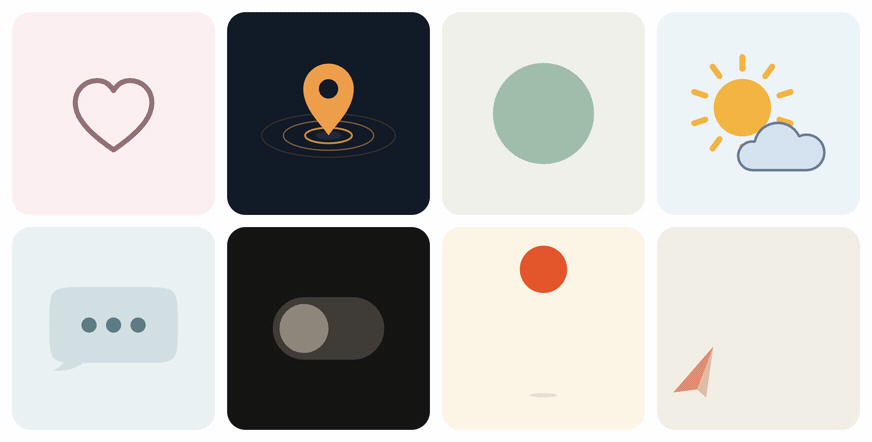
</picture>

[Gallery](#gallery) · [Palettes](#palettes) · [What to ask for](#what-to-ask-for) · [Tools](#tools) · [Install](#install) · [Live page](https://obeskay.github.io/lottie-animator-skill/)


</div>

## Why

A broken Lottie still parses. Leave the `os` off a polystar, put an easing handle one
level too high, forget `ip`/`op` on a layer — the JSON is valid, the player raises
nothing, and the canvas stays empty. A validator that checks `json.load()` calls it fine.

And a Lottie that renders can still be bad: linear, bouncy, crowded, purple. Generated
motion drifts to all four by default.

This skill answers both. The tools catch the silent failures and render every file, so
the agent has to look at what it made; the recipes, the motion tokens and the palettes
make the first draft quiet, precise and on-palette instead of generic.

## What to ask for

| Say to Claude Code | What it does |
|---|---|
| *"A success animation for our checkout, in the forest palette"* | Starts from `success-check`, re-skins it, lints, renders, and shows you the filmstrip |
| *"Animate this SVG logo with a quiet entrance"* | Converts the SVG, cascades its parts, reads the onion skin to check the easing |
| *"A loader that works in dark mode"* | `spinner-arc` in `night`, with the loop seam checked frame against frame |
| *"Make this LottieFiles animation match our brand colours"* | `recolor.py --list`, then maps each colour by its role |
| *"Why does this Lottie render blank?"* | Lints it, names the defect (say `KF012`), fixes it, renders the proof |

## Gallery

Every GIF below is the JSON in [`examples/`](examples) rendered by
[`scripts/make-gifs.mjs`](scripts/make-gifs.mjs) in a real lottie-web — the same player
the skill uses to check its own work. Each one is written by the `.py` beside it; open it
to see the brief, the beats and the tokens.

<table>
<tr>
<td width="33%" align="center" valign="top">
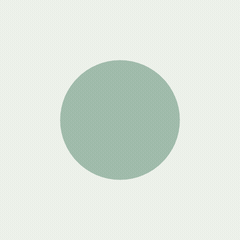<br>
<a href="examples/success-check.py"><code>success-check</code></a><br>
<sub>Disc settles, check writes itself, one quiet ripple.<br><code>forest</code> · one-shot · 1.6 s</sub>
</td>
<td width="33%" align="center" valign="top">
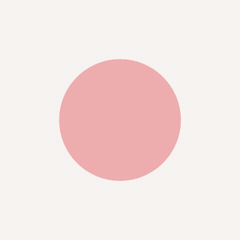<br>
<a href="examples/error-shake.py"><code>error-shake</code></a><br>
<sub>Disc settles, X writes itself, then one crisp decaying shake.<br><code>mono</code> · one-shot · 1.5 s</sub>
</td>
<td width="33%" align="center" valign="top">
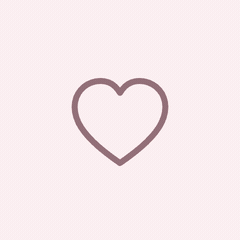<br>
<a href="examples/heart-like.py"><code>heart-like</code></a><br>
<sub>Press, pop, burst: the one playful example, labelled as such.<br><code>berry</code> · one-shot · 1.67 s</sub>
</td>
</tr>
<tr>
<td width="33%" align="center" valign="top">
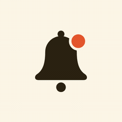<br>
<a href="examples/notification-bell.py"><code>notification-bell</code></a><br>
<sub>One ring that swings itself still, the clapper a beat behind.<br><code>citrus</code> · loop · 2 s</sub>
</td>
<td width="33%" align="center" valign="top">
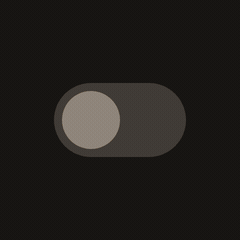<br>
<a href="examples/toggle-switch.py"><code>toggle-switch</code></a><br>
<sub>Off, on, off: the knob and both colours move on one curve.<br><code>night</code> · loop · 2 s</sub>
</td>
<td width="33%" align="center" valign="top">
<br>
<a href="examples/lock-unlock.py"><code>lock-unlock</code></a><br>
<sub>The shackle lifts free and the colour follows; then it locks again.<br><code>sky</code> · loop · 2 s</sub>
</td>
</tr>
<tr>
<td width="33%" align="center" valign="top">
<br>
<a href="examples/play-pause.py"><code>play-pause</code></a><br>
<sub>Each half of the play triangle squares off into a pause bar, and back.<br><code>dusk</code> · loop · 2 s</sub>
</td>
<td width="33%" align="center" valign="top">
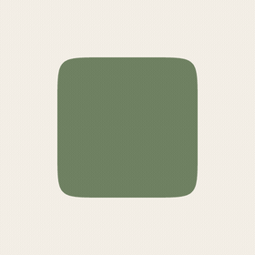<br>
<a href="examples/shape-morph.py"><code>shape-morph</code></a><br>
<sub>A squircle softens into a circle and back, a quarter turn per cycle.<br><code>sky</code> · loop · 2 s</sub>
</td>
<td width="33%" align="center" valign="top">
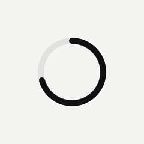<br>
<a href="examples/spinner-arc.py"><code>spinner-arc</code></a><br>
<sub>Head leads, tail follows, the ring turns: a seamless indeterminate spinner.<br><code>mono</code> · loop · 4 s</sub>
</td>
</tr>
<tr>
<td width="33%" align="center" valign="top">
<br>
<a href="examples/typing-dots.py"><code>typing-dots</code></a><br>
<sub>A three-dot wave with a rest, so it reads as typing.<br><code>harbor</code> · loop · 1.33 s</sub>
</td>
<td width="33%" align="center" valign="top">
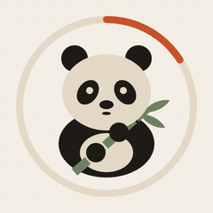<br>
<a href="examples/panda-loader.py"><code>panda-loader</code></a><br>
<sub>A panda chews bamboo inside a slow, breathing loading ring.<br><code>paper</code> · loop · 2 s</sub>
</td>
<td width="33%" align="center" valign="top">
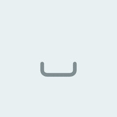<br>
<a href="examples/download-progress.py"><code>download-progress</code></a><br>
<sub>Arrow into tray, a ring that fills at an uneven pace, then a check.<br><code>harbor</code> · one-shot · 3.73 s</sub>
</td>
</tr>
<tr>
<td width="33%" align="center" valign="top">
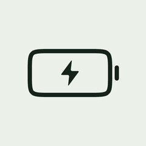<br>
<a href="examples/battery-charge.py"><code>battery-charge</code></a><br>
<sub>Charge climbs in eased steps, the bolt settles, then it drains.<br><code>forest</code> · loop · 4 s</sub>
</td>
<td width="33%" align="center" valign="top">
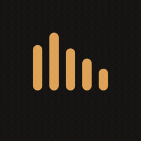<br>
<a href="examples/equalizer.py"><code>equalizer</code></a><br>
<sub>Five bars, each on its own tempo, bass slow and treble quick.<br><code>night</code> · loop · 2 s</sub>
</td>
<td width="33%" align="center" valign="top">
<br>
<a href="examples/location-ping.py"><code>location-ping</code></a><br>
<sub>A still pin; rings spread across the ground, thin and fade.<br><code>dusk</code> · loop · 2 s</sub>
</td>
</tr>
<tr>
<td width="33%" align="center" valign="top">
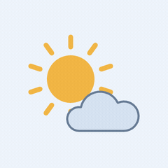<br>
<a href="examples/weather-sun.py"><code>weather-sun</code></a><br>
<sub>Rays turn slowly while a cloud drifts across the sun and back.<br><code>sky</code> · loop · 4 s</sub>
</td>
<td width="33%" align="center" valign="top">
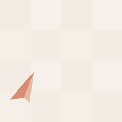<br>
<a href="examples/paper-plane.py"><code>paper-plane</code></a><br>
<sub>A paper plane cruises in on a curve, turning with it, and leaves a dashed trail.<br><code>paper</code> · one-shot · 1.53 s</sub>
</td>
<td width="33%" align="center" valign="top">
<br>
<a href="examples/confetti-burst.py"><code>confetti-burst</code></a><br>
<sub>Playful but restrained: one pop, fourteen pieces on ballistic arcs.<br><code>berry</code> · loop · 2 s</sub>
</td>
</tr>
<tr>
<td width="33%" align="center" valign="top">
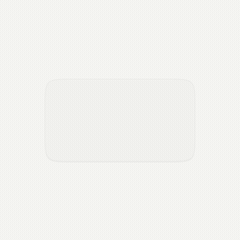<br>
<a href="examples/card-stack.py"><code>card-stack</code></a><br>
<sub>Three cards settle back to front; the content writes in; the chip lands last.<br><code>mono</code> · one-shot · 2 s</sub>
</td>
<td width="33%" align="center" valign="top">
<br>
<a href="examples/logo-draw-on.py"><code>logo-draw-on</code></a><br>
<sub>An SVG mark writes its lines; the sun rises out of the horizon, last.<br><code>paper</code> · one-shot · 2.17 s</sub>
</td>
<td width="33%" align="center" valign="top">
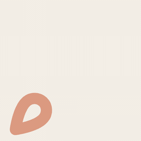<br>
<a href="examples/rocket-launch.py"><code>rocket-launch</code></a><br>
<sub>An SVG icon, converted part by part, assembles and lifts off its own axis.<br><code>paper</code> · one-shot · 2.5 s</sub>
</td>
</tr>
<tr>
<td width="33%" align="center" valign="top">
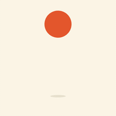<br>
<a href="examples/bouncing-ball.py"><code>bouncing-ball</code></a><br>
<sub>Playful: squash and stretch at constant volume, spaced by gravity.<br><code>citrus</code> · loop · 1 s</sub>
</td>
</tr>
</table>

## Palettes

<div align="center">

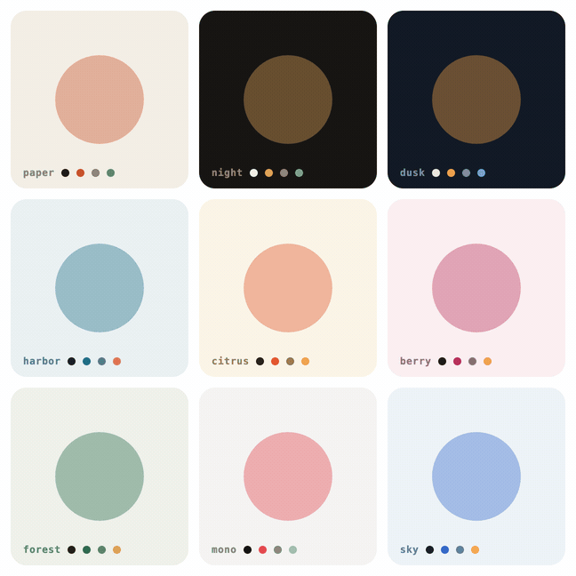

</div>

Every example is written against colour roles — ground, surface, ink, muted, accent,
on-accent, support — never hex values, so any of them renders in any palette:

```bash
python3 examples/heart-like.py --palette dusk -o heart-dusk.json
```

| Palette | Character |
|---|---|
| `paper` | warm paper, ink and clay — the house default |
| `night` | warm charcoal with an amber accent, for dark mode |
| `dusk` | navy and tungsten |
| `harbor` | sea glass with a deep teal |
| `citrus` | cream, tangerine and saffron |
| `berry` | blush, raspberry and apricot |
| `forest` | sage, pine and mustard |
| `mono` | greys and one signal red |
| `sky` | pale blue, cobalt and sun |

The tests hold each palette to its contrast ratios — ink at 7:1 or more on its ground,
accent and muted at 3:1 — so nothing drawn against the roles disappears. For a brand, add
a palette with the same seven roles. For a file made elsewhere, `recolor.py` lists its
colours and maps them.

## Tools

The Python tools are dependency-free; the renderer needs Node and a local Chrome.

### `motion.py` — the house style as code

Easing tokens (strong ease-out, zero overshoot; `playful` exists for briefs that ask for
bounce), the palettes, and builders for every shape, paint, modifier, layer and
composition. A generator never types a handle, a hex value or a required property, so the
defects below cannot be written in the first place.

```python
from motion import *

def build(c):                                          # c is a palette, by role
    disc = layer("Disc", group("Disc", ellipse(128), fill(c["accent"])),
                 p=(120, 120),
                 s=track((0, [92, 92], "out"), (22, [100, 100])),
                 o=track((0, 0, "out"), (10, 100)))
    return comp("Disc", 240, 240, [disc], op=90, bg=c["bg"])

main(build, __file__, palette="paper")                 # --palette night -o out.json
```

### `svg2lottie.py` — SVG to Lottie shape layers

Converts paths, rects, circles, ellipses, lines, polygons, polylines, groups,
transforms, strokes, and linear/radial gradients. Full path grammar including elliptical
arcs, smooth curves, and relative commands. Each element becomes its own named layer,
anchored at its own centre so scale and rotation pivot where you expect.

```bash
python3 scripts/svg2lottie.py icon.svg -o icon.json --size 512 --current-color "#1E1B18"
```

### `lottie_lint.py` — the defects that render blank

Structural checks, plus the ones that actually bite: per-shape required properties,
easing handles on the wrong object, keyframes without handles that freeze the player,
layers outside the composition range, permanently transparent layers, geometry with no
paint, parent cycles, loops that do not close, and groups painted underneath an opaque
sibling. Two taste notes name the commonest tells of generated motion — something growing
from a point, easing that overshoots — without failing a build.

```bash
python3 scripts/lottie_lint.py examples/          # a directory
python3 scripts/lottie_lint.py a.json --strict    # warnings fail too
python3 scripts/lottie_lint.py a.json --json      # machine-readable
```

### `render.mjs` — see it

Loads the file in real `lottie-web`, samples the timeline on the ground it was designed
for, and writes PNG frames plus a contact sheet. Flags empty frames (a layer faded to 0
counts as empty), content off canvas, and content clipped by the edge — measured on the
drawn outline, so a spinning ring is not mistaken for a clipped one.

```bash
node scripts/render.mjs a.json --at 0,25,50,75,100
node scripts/render.mjs a.json --frames 0,12,24 --bg "#171513"
node scripts/render.mjs a.json --onion     # frames stacked: spacing is the easing, the path is the arc
```

### `recolor.py` — any Lottie, any palette

Lists every colour in a file with its uses and layers, then maps them — static and
animated fills and strokes, gradient stops, text and solid layers.

```bash
python3 scripts/recolor.py downloaded.json --list
python3 scripts/recolor.py downloaded.json --map "#FF5A5F=#C8522B" --map "#222222=#1E1B18" -o ours.json
```

## How the skill works

```
recipe or SVG  →  build  →  lint  →  render  →  LOOK  →  revise
```

Before touching a keyframe it decides the motion — feeling, register, one hero property,
timing, easing, palette. It starts from the nearest recipe or from real SVG geometry,
never from hand-typed vertices, then lints, renders, and reads the filmstrip and the
onion skin against an eight-question taste pass. It is told not to claim visual quality
it has not seen.

References live beside the skill:
[motion taste](skills/lottie-animator/references/motion-taste.md) ·
[recipes](skills/lottie-animator/references/examples.md) ·
[structure](skills/lottie-animator/references/lottie-structure.md) ·
[SVG → Lottie](skills/lottie-animator/references/svg-to-lottie.md) ·
[shape modifiers](skills/lottie-animator/references/shape-modifiers.md) ·
[Disney principles](skills/lottie-animator/references/disney-principles.md) ·
[techniques](skills/lottie-animator/references/professional-techniques.md) ·
[GSAP](skills/lottie-animator/references/lottie-gsap-integration.md)

## Install

### As a Claude Code plugin

```bash
/plugin marketplace add obeskay/lottie-animator-skill
/plugin install lottie-animator
```

### As a plain skill

Clone the repository and link `skills/lottie-animator/` into your skills directory, so
its `scripts/` and `examples/` links resolve; run `npm install` once in the clone for the
renderer. Copied without them, the skill degrades to guidance only and says so.

## Development

```bash
python3 -m unittest discover -s tests -v   # 132 tests, stdlib only
python3 scripts/lottie_lint.py examples/ --strict
npm install && node scripts/render.mjs examples/success-check.json
node scripts/make-gifs.mjs                  # every GIF, the hero, the palette board
```

The tests rebuild every example from its generator and fail if the committed JSON has
drifted, lint each one in all nine palettes, and hold the palettes to their contrast
ratios. Path arithmetic is pinned against hand-computed coordinates, and arc direction
was verified against Chrome's own rendering of the same path data.

To browse the examples live, serve the repository and open the landing page, which
plays every example and re-skins them in any palette:

```bash
python3 -m http.server 8000     # then http://localhost:8000/docs/
```

See [CONTRIBUTING.md](CONTRIBUTING.md).

## License

MIT — see [LICENSE](LICENSE).

<div align="center">

[GitHub](https://github.com/obeskay/lottie-animator-skill) · [obeskay](https://obeskay.com)

</div>
